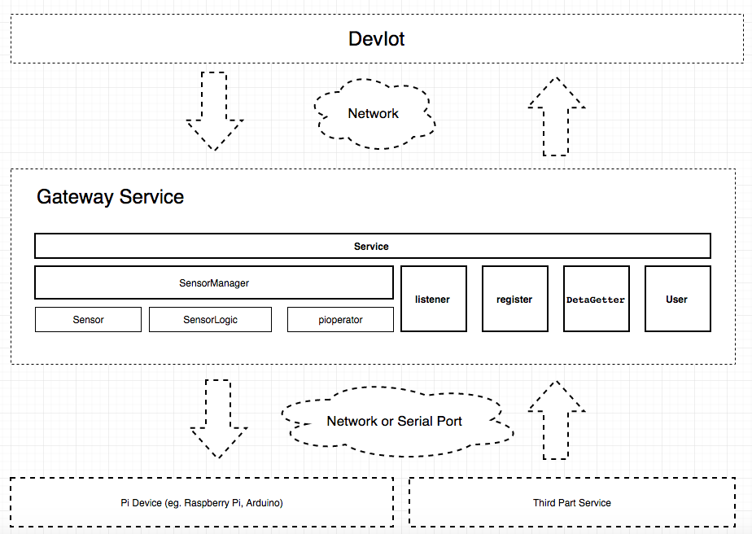
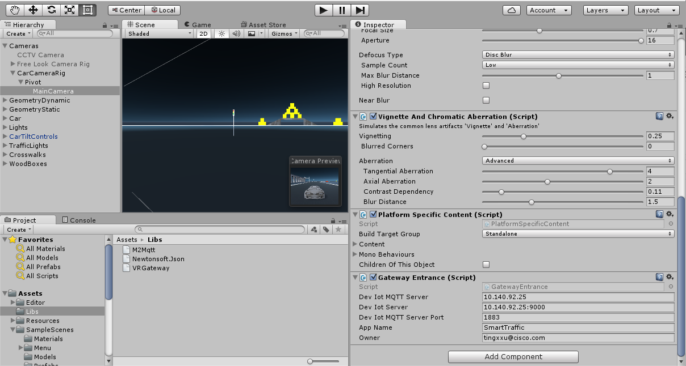

# Starter Kit of Game Gateway Service for the Cisco Development Platform Internet of Things (IoT)
##Description
A Starter Kit for building the game gateway service to work with the [Cisco DevIoT](http://developer.cisco.com/site/devnetlabs/deviot/)

The document and the code samples will provide a complete end to end example of how to use this SDK to build a gateway service to work with [Cisco DevIoT](http://developer.cisco.com/site/devnetlabs/deviot/).

DevIoT is an Internet of things development environment enabling frictionless design and
 deployment of complex IoT solutions.[more detail](http://developer.cisco.com/site/devnetlabs/deviot/)

The SDK focus on follow things:
* Register sensors to DevIot platform
* Help developer build sensors in Unity3d Game quickly
* Sync up the sensor data between Game and DevIot
* Recevie command from DevIot to trigger the sensor

## Table of contents

* [What in this code](#what-in-this-code)
* [Prerequisite](#prerequisite)
* [How to use](#how-to-use)
* [SDK API](#sdk-api)
* [Getting help](#getting-help)

## What in this code
* SDK folder: this SDK lib
* DevIotCar.unitypackage: Source code for the a sample game

## Prerequisite
* This SDK base on The dot net 2.0
* Need Unity3d to build the source code

## How to use
* Create a new Unity3d project
* Import the DevIotCar.unitypackage by the tool menu "Assets"/"Import Package"
* Configurate the Gateway like follow image
  
* Build game by tool menu "File"/"Build & Run"
* Run you game

then you can fond the "speed sensor","break sensor","break run sensor" in your deviot platfrom, use it as other sensors!
## tags
version:1.0.0
